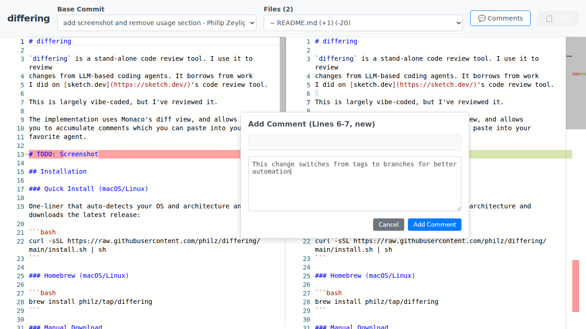

# differing

`differing` is a stand-alone code review tool. I use it to review
changes from LLM-based coding agents. It borrows from work
I did on [sketch.dev](https://sketch.dev/)'s code review tool.

This is largely vibe-coded, but I've reviewed it.

The implementation uses Monaco's diff view, and allows
you to accumulate comments which you can paste into your
favorite agent.



## Installation

### Quick Install (macOS/Linux)

One-liner that auto-detects your OS and architecture and downloads the latest release:

```bash
curl -sSL https://raw.githubusercontent.com/philz/differing/main/install.sh | sh
```

### Homebrew (macOS/Linux)

```bash
brew install philz/tap/differing
```

### Manual Download

Download pre-built binaries from the [releases page](https://github.com/philz/differing/releases/latest).

Binaries are named `differing_<os>_<arch>` and are released automatically on every commit to main.

**Examples:**
```bash
# macOS Intel
curl -LO https://github.com/philz/differing/releases/latest/download/differing_darwin_amd64
chmod +x differing_darwin_amd64
mv differing_darwin_amd64 differing

# macOS Apple Silicon
curl -LO https://github.com/philz/differing/releases/latest/download/differing_darwin_arm64
chmod +x differing_darwin_arm64
mv differing_darwin_arm64 differing

# Linux x86_64
curl -LO https://github.com/philz/differing/releases/latest/download/differing_linux_amd64
chmod +x differing_linux_amd64
mv differing_linux_amd64 differing
```

**Windows:**

Download `differing_windows_amd64` or `differing_windows_arm64` from the [releases page](https://github.com/philz/differing/releases/latest).

### Build from Source

```bash
git clone https://github.com/philz/differing.git
cd differing
make
```

## Releases

New releases are automatically created on every commit to `main`. Versions follow the pattern `v0.0.N` where N is the total commit count.

## License

MIT License - feel free to use this as a foundation for your own diff viewing tools!
